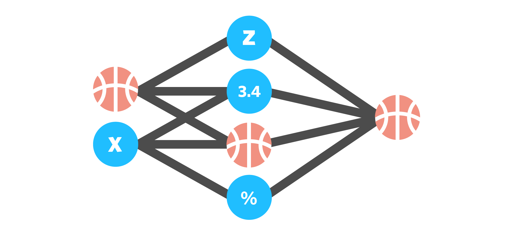

# INFO-3608-PROJECT

## March Machine Learning Mania 2025

**Project Overview**

This is a COMP 3608 S-Rank Mission project focused on the Kaggle March Machine Learning Mania 2025 competition. As part of the course requirements, our team will attempt to achieve a top 10 position on the competition leaderboard by developing a predictive model for NCAA Men's and Women's Basketball Tournament outcomes.

**Problem Statement**

The objective of this project is to forecast the outcomes of the NCAA Division 1 Men's and Women's basketball championships in 2025. To make these forecasts, we will utilize historical game data from the thousands of NCAA basketball games played between Division I college basketball teams each season. Machine learning algorithms that examine this historical data will be used. We will be use the results to predict the outcome of every potential matchup with the aid of these models. Sports experts, coaches, bettors, and sponsors may find our forecasts useful to make better judgments.
